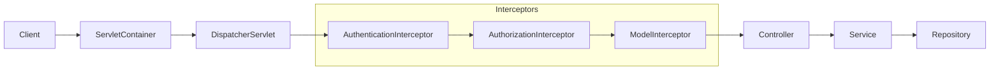

# 물류 서비스

편리하게 물류를 관리하는 하는 웹 어플리케이션입니다.

- [개인 블로그](https://devjay.blog)
- [프로젝트 살펴보기](https://devjay-logistics.run.goorm.io)

현재 구름 컨테이너를 이용해서 배포 하고 있습니다. 가격도 저렴하고 설정도 쉬워서 선택 했습니다.

프로젝트 세부 사항에 대해서는 [프로젝트 살펴보기](https://devjay-logistics.run.goorm.io)에 로그인하면 확인하실 수 있습니다. 다음은 간략하게 나열한 세부 사항입니다.

- 스프링 메세지를 통한 국제화 (한국어, 영어 지원)
- 유저 Soft Delete 구현 (논리적 삭제)
- 서비스 레이어가 다른 레이어에 최소한만 의존하도록 구현
- 세션 매니저를 구현해서, 중복 로그인 방지

현재는 어드민 패널의 로깅 기능이 덜 구현되어 있습니다.

이 프로젝트의 최종 목표로 스프링 AOP를 활용해 관심사를 분리하고 사용자들의 행위를 로깅하는 기능을 구현하려고 합니다.
따라서 최근에는 프록시를 학습하고 있습니다.

## 프로젝트 구조

## 사용 기술

- Spring Boot
- Bean Validation
- Spring Web
- Thymeleaf
- MyBatis
- TailwindCSS

`MyBatis`는 ORM에 비해 동적 쿼리 문제를 깔끔하게 해결할 수 았기도 하고, 학습량도 낮아 빠르게 사용할 수 있어서 선택 했습니다.

`Thymeleaf`는 스프링 MVC와의 통합이 잘 이루어져 있는 템플릿 엔진이라 선택했습니다. MVC 구조의 웹 어플리케이션을 개발할 때 쉽고 편리하게 다양한 기능을 사용할 수 있습니다.

## 데이터 초기화

테스트용 계정을 초기화 해두었습니다. 유저네임과 패스워드는 동일합니다. 예를 들면 회원 `user`의 패스워드는 `user`로 초기화 합니다.

이 외에도 확인용 데이터를 초기화 해두었습니다.

- user: User 회원 등급의 계정입니다.
- editor: Editor 회원 등급의 계정입니다.
- admin: Admin 회원 등급의 계정입니다.
- test: Admin 회원 등급의 계정입니다.